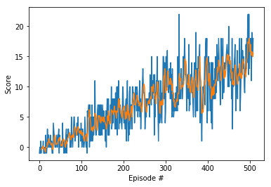

# REPORT
### Reinaldo Maslim

The learning algorithm used here is DQN agent with 3 fully connected layers. The first and second layers have 64 units, while the output layer has 4 which is equal to the environment's action size. 

Below are the list of hyperparameters in this implementation:

    fc1_units        # number of nodes in first hidden layer
    fc2_units        # number of nodes in second hidden layer
    BUFFER_SIZE      # replay buffer size
    BATCH_SIZE       # minibatch size
    GAMMA            # discount factor
    TAU              # for soft update of target parameters
    LR               # learning rate 
    UPDATE_EVERY     # how often to update the network
    n_episodes       # maximum number of training episodes
    max_t            # maximum number of timesteps per episode
    eps_start        # starting value of epsilon (epsilon-greedy)
    eps_end          # minimum value of epsilon (epsilon-greedy)
    eps_decay        # multiplicative factor (per episode) for decreasing epsilon

Using the above parameters combinations we can achieve the target average reward of minimum +13 within 300 episodes as shown below.

More works that may improve the performances are:

1. Apply deeper network to better approximate q-value function.
2. Implement more sophisticated variations of dqn such as duelling_dqn or double_dqn 
3. Use prioritized experience replay
4. Perform coarse coding on the states
